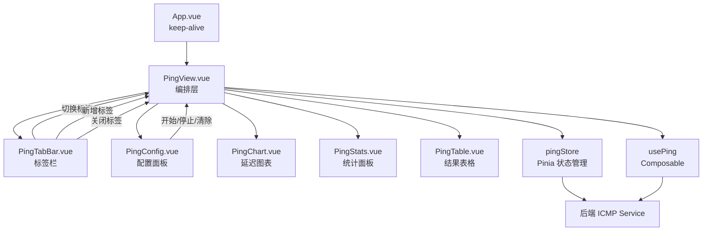
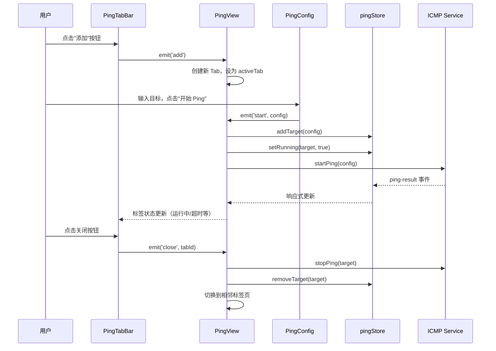

# 设计文档：多目标同时 Ping

## 概述

本设计将 PingView 从单目标监控升级为多标签页（Tab）多目标并发监控。核心改动集中在前端 UI 层：在 `PingView.vue` 中引入标签栏（TabBar）组件，管理多个目标标签页的生命周期、切换和状态可视化。

**关键设计决策：**

1. **后端零改动**：后端 `PING_SESSIONS` HashMap 已天然支持多 session 并发，`pingStore` 已按 target 键值管理数据，无需修改。
2. **新增 TabBar 组件**：将标签页管理逻辑封装为独立的 `PingTabBar.vue` 组件，职责单一。
3. **PingView 作为编排层**：PingView 负责管理标签页列表（tabs 数组）、活跃标签页（activeTabId）、以及协调 TabBar 与现有子组件（PingConfig、PingChart、PingStats、PingTable）之间的交互。
4. **现有子组件不改动**：PingConfig、PingChart、PingStats、PingTable 已通过 `target` prop 支持不同目标，无需修改。
5. **keep-alive 兼容**：App.vue 使用 `<keep-alive>` 包裹路由组件，PingView 需在 `onActivated`/`onDeactivated` 中处理生命周期，而非仅依赖 `onMounted`/`onUnmounted`。

## 架构

### 组件层级



### 数据流



## 组件和接口

### 1. PingTabBar.vue（新增组件）

标签栏组件，负责渲染所有标签页和操作按钮。

```typescript
// Props
interface PingTabBarProps {
  tabs: PingTab[]           // 所有标签页数据
  activeTabId: string       // 当前活跃标签页 ID
}

// Emits
interface PingTabBarEmits {
  (e: 'select', tabId: string): void    // 切换标签页
  (e: 'add'): void                      // 新增标签页
  (e: 'close', tabId: string): void     // 关闭标签页
}
```

**职责：**
- 渲染标签页列表，每个标签显示目标地址、运行状态指示器（绿色/灰色/红色圆点）、最新延迟值
- 提供"+"按钮用于新增标签页
- 每个标签页提供"×"关闭按钮
- 高亮当前活跃标签页
- 标签页过多时支持横向滚动

### 2. PingView.vue（重构）

从单目标改为多标签页编排层。

```typescript
// 内部状态
const tabs = ref<PingTab[]>([])          // 所有标签页
const activeTabId = ref<string>('')       // 当前活跃标签页 ID

// 计算属性
const activeTab: ComputedRef<PingTab | undefined>  // 当前活跃标签页
const activeTarget: ComputedRef<string>             // 当前活跃目标地址
const hasRunningTargets: ComputedRef<boolean>       // 是否有正在运行的目标

// 方法
function addTab(): void                   // 新增标签页
function closeTab(tabId: string): void    // 关闭标签页
function selectTab(tabId: string): void   // 切换标签页
function handleStart(config: TargetConfig): void   // 开始 Ping
function handleStop(target: string): void          // 停止 Ping
function handleClear(target: string): void         // 清除结果
function stopAllRunning(): void                    // 全部停止
```

**关键行为：**
- `addTab()`：生成唯一 tabId，创建空白标签页（默认目标为空字符串），设为活跃
- `closeTab(tabId)`：停止该目标的 Ping 会话，从 store 移除数据，从 tabs 中移除。若关闭的是最后一个标签页，自动创建新的默认标签页
- `handleStart(config)`：更新当前标签页的 target 字段，调用 store 和后端启动 Ping
- 页面首次加载时创建一个默认标签页（目标 `8.8.8.8`）

### 3. 现有组件（无改动）

| 组件 | 接口 | 说明 |
|------|------|------|
| `PingConfig` | `props: { target, isRunning }` | 已支持 target prop |
| `PingChart` | `props: { target }` | 已按 target 从 store 获取数据 |
| `PingStats` | `props: { target }` | 已按 target 从 store 获取统计 |
| `PingTable` | `props: { target }` | 已按 target 从 store 获取结果 |

### 4. pingStore（微调）

Store 本身已支持多目标，但需要新增一个辅助 getter：

```typescript
// 新增：获取目标的最新一条结果（用于 TabBar 显示延迟值和超时状态）
function getLatestResult(target: string): PingResult | undefined {
  const targetResults = results.value.get(target)
  if (!targetResults || targetResults.length === 0) return undefined
  return targetResults[targetResults.length - 1]
}
```

## 数据模型

### PingTab 接口（新增）

```typescript
// 定义在 src/types/index.ts
interface PingTab {
  id: string          // 唯一标识符（nanoid 或 crypto.randomUUID()）
  target: string      // 目标地址（IP 或域名），新建时为空字符串
}
```

**设计说明：**
- `id` 使用 `crypto.randomUUID()` 生成，无需额外依赖
- `target` 在用户首次点击"开始 Ping"时由 PingConfig 的输入值确定
- 运行状态、结果数据、统计数据均由 `pingStore` 按 `target` 键管理，不在 Tab 对象中冗余存储

### 标签页状态派生（非存储，实时计算）

标签页的可视化状态通过 `pingStore` 实时派生，不额外存储：

```typescript
// 在 PingTabBar 中通过 computed 派生
type TabStatus = 'running' | 'stopped' | 'timeout'

function getTabStatus(target: string): TabStatus {
  if (!pingStore.isRunning(target)) return 'stopped'
  const latest = pingStore.getLatestResult(target)
  if (latest?.is_timeout) return 'timeout'
  return 'running'
}

function getTabLatency(target: string): string {
  const latest = pingStore.getLatestResult(target)
  if (!latest) return ''
  if (latest.is_timeout) return t('ping.timeoutText')
  return `${latest.latency_ms?.toFixed(1)}ms`
}
```

### i18n 新增键值

```typescript
// 新增到 ping 命名空间下
{
  ping: {
    // ... 现有键值保持不变
    addTab: '添加目标',        // en: 'Add Target'
    closeTab: '关闭标签页',     // en: 'Close Tab'
    stopAll: '全部停止',        // en: 'Stop All'
    newTab: '新标签页',         // en: 'New Tab'
    defaultTarget: '8.8.8.8',  // en: '8.8.8.8'（不翻译）
    tabTimeout: '超时',         // en: 'Timeout'
  }
}
```

